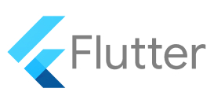

# ITSE304 Project - Cross-Platform Mobile Application

 

## Overview

This Flutter project is a cross-platform mobile application developed as part of the ITSE304 course. It showcases a clean architecture, state management using Cubit, and implements user authentication and profile management features. The application is designed as a bone base for other projects.

## Features

-   **User Authentication:**
    -   Secure user registration and login.
    -   Password hashing using bcrypt.
    -   Session management.
-   **Profile Management:**
    -   View and update user profile information.
-   **Navigation:**
    -   Bottom navigation bar implementing GoRouter for easy access to different sections of the app.
-   **Cubit State Management:**
-   **Local Data Persistence:**
    -   Utilizes SQLite for local data storage.
-   **Logging:**
    -   Comprehensive and Bueatiful logging using `Logger` for debugging and monitoring.
-   **Session Token:** using Shared Preferences

## Architecture

The project follows a layered architecture to ensure separation of concerns and maintainability:

-   **Presentation Layer (GUI):**
    -   UI components and screens built with Flutter widgets.
    -   Responsible for rendering the UI and handling user interactions.
    -   Located in `lib/gui/`.
-   **Business Logic Layer (BLoC):**
    -   Manages the application's state and business logic.
    -   Uses the BLoC pattern to handle state changes and events.
    -   Located in `lib/cubit/`.
-   **Data Layer (Core):**
    -   Handles data storage and retrieval.
    -   Includes database helper classes and data models.
    -   Located in `lib/core/`.

## Libraries Used

-   **Flutter SDK:**
    -   UI framework for building cross-platform applications.
-   **sqflite:**
    -   SQLite plugin for Flutter to manage local databases.
-   **bcrypt:**
    -   Password hashing library for secure user authentication.
-   **flutter_bloc:**
    -   Library for implementing the BLoC pattern in Flutter.
-   **path:**
    -   Provides utilities for working with file paths.
-   **shared_preferences:**
    -   For storing simple data.
-   **Logger**
    -   For beatufil Debug Console Logs.

## Getting Started

### Prerequisites

-   [Flutter SDK](https://flutter.dev/docs/get-started/install)
-   [Android Studio](https://developer.android.com/studio) or [Xcode](https://developer.apple.com/xcode/)
-   [Visual Studio Code](https://code.visualstudio.com/) (optional)

### Installation

1.  Clone the repository:

    ```sh
    git clone https://github.com/arousi/itse304_project.git
    cd itse304_project
    ```

2.  Install dependencies:

    ```sh
    flutter pub get
    ```

### Running the App

1.  Connect an Android or iOS device, or start an emulator.
2.  Run the app:

    ```sh
    flutter run
    ```

## Project Structure

-   `lib/`: Contains the main source code.
    -   `core/`: Core functionalities such as database management.
        -   `utils/`: Utility classes.
            -   `db_helper.dart`: Database helper class for SQLite operations.
    -   `cubit/`: Contains BLoC files for state management.
        -   `auth/`: Authentication-related BLoC files.
            -   `auth_cubit.dart`: Manages authentication state.
            -   `auth_state.dart`: Defines authentication states.
        -   `navigation/`: Navigation-related BLoC files.
            -   `navigation_cubit.dart`: Manages navigation state.
            -   `navigation_state.dart`: Defines navigation states.
        -   `profile/`: Profile-related BLoC files.
            -   `profile_cubit.dart`: Manages profile state.
            -   `profile_state.dart`: Defines profile states.
    -   `gui/`: Contains the UI files.
        -   `auth/`: Authentication-related UI files.
            -   `login_screen.dart`: Login screen UI.
            -   `signup_screen.dart`: Sign-up screen UI.
        -   `main/`: Main screen UI files.
            -   `main_screen.dart`: Main screen with bottom navigation.
        -   `profile/`: Profile screen UI files.
            -   `profile_screen.dart`: User profile screen UI.
    -   `widgets/`: Contains reusable widgets.
        -   `custom_button.dart`: Custom button widget.
        -   `custom_text_field.dart`: Custom text field widget.
    -   `main.dart`: Entry point of the application.

## Usage

### Authentication

-   **Sign Up:** Create a new user account with a secure password.
-   **Login:** Authenticate an existing user using email and password.
-   **Logout:** Sign out the current user.

### Navigation using GoRouter

-   **Home Screen:** The main screen of the app.
-   **Profile Screen:** The user's profile screen to view and update information.

### State Management

-   **AuthCubit:** Manages authentication state (e.g., logged in, logged out).
-   **ThemeCubit:** Manages Theme state.

## License

This project is licensed under the MIT License. See the LICENSE file for details.

## Acknowledgements

-   Flutter
-   BLoC
-   SQLite
-   bcrypt

## Contact


For any inquiries, please contact @arousi on GitHub or @LibyaChampion on tele.
